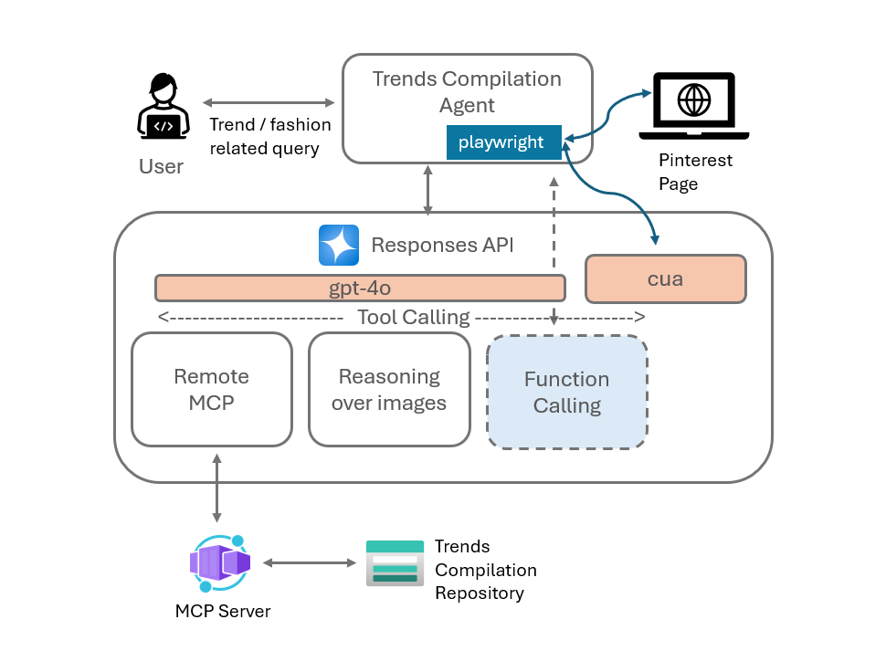

# Fashion Trends Compiler Agent with Azure OpenAI Responses API

An intelligent AI-powered system that uses Azure OpenAI's Computer Use (CUA) capabilities to automatically explore, analyze, and compile fashion trends from Pinterest. The system uses browser automation to navigate Pinterest, analyze images, extract content, and generate comprehensive markdown reports, with optional Azure Blob Storage integration via Model Context Protocol (MCP). The Responses API in Azure openAI provides turnkey tool action support for CUA model and MCP Server integration. Azure AI Foundry provides the ability to provision the Models in Azure openAI along with the SDK support for Responses API.

## 🚀 Key Features

- **🤖 AI-Powered Browser Automation**: Uses Azure OpenAI's Computer Use capabilities to autonomously navigate Pinterest
- **🎯 Intelligent Trend Discovery**: Systematically searches and analyzes fashion trend items
- **🎨 Advanced Image Analysis**: Detailed analysis of visual trends, colors, patterns, and design elements
- **📝 Smart Content Extraction**: Automatically extracts descriptions and expands "Read more" content
- **📊 Markdown Report Generation**: Organizes findings into well-structured, professional markdown reports
- **☁️ Azure Blob Storage Integration**: Saves compiled reports to Azure Blob Storage using MCP server
- **📈 Real-time Progress Tracking**: Live updates during the exploration process
- **💬 Interactive CLI Interface**: User-friendly command-line interface with conversation flow

## 🏗️ System Architecture

### Core Components

```
trends-compiler-cua-mcp/
├── app.py                     # Main CLI application entry point
├── call_computer_use.py       # Trends compilation orchestrator
├── requirements.txt           # Python dependencies
├── .env                       # Environment configuration (create from template)
├── trends/                    # Core trends analysis module
│   ├── __init__.py
│   ├── app_client.py          # Azure OpenAI Responses API client
│   ├── compiler.py            # Main trends compilation engine
│   ├── config.py              # Configuration management
│   ├── ai_client.py           # AI interaction layer
│   ├── action_handler.py      # Computer action execution
│   └── parsers.py             # Response and coordinate parsing
└── common/                    # Shared automation utilities
    ├── __init__.py
    ├── computer.py            # Computer use interface protocol
    ├── local_playwright.py    # Playwright browser automation
    └── utils.py               # Utility functions
```

### Integration Points

- **Azure OpenAI Responses API**: Powers AI-driven browser automation and analysis
- **Model Context Protocol (MCP)**: Enables Azure Blob Storage operations
- **Playwright**: Provides robust web browser automation
- **Pinterest Website**: Target platform for fashion trends discovery

### Architecture of the Solution

The Trends Compiler Agent is a sophisticated command-line application that combines Azure OpenAI's Computer Use capabilities with browser automation to autonomously discover and analyze fashion trends. Built on the Azure OpenAI Responses API, it provides seamless integration with Computer Use models, advanced image reasoning, and Remote Model Context Protocol (MCP) for cloud storage operations.

#### 🎯 Core Architecture Overview

The solution operates as a locally-hosted intelligent agent that leverages:
- **Azure OpenAI Responses API** for AI-driven decision making and content analysis
- **Computer Use (CUA) Model** for visual understanding and browser interaction planning
- **Playwright Browser Automation** for precise web navigation and interaction
- **Remote MCP Integration** for seamless Azure Blob Storage operations

#### 🔄 Workflow Process

The agent follows a sophisticated multi-stage process to compile comprehensive trend reports:

##### **1. Initial Setup & Navigation**
- **Target Loading**: Navigates to the configured Pinterest URL and waits for complete page rendering
- **Interface Recognition**: Uses Computer Use capabilities to identify and locate the search interface elements
- **Query Input**: Employs Playwright to interact with the search box and submit user queries

##### **2. Search Results Processing**
- **Results Detection**: Computer Use model analyzes the page to determine when search results are fully loaded
- **Image Identification**: Identifies and maps coordinates of all trend images displayed in search results
- **Bounding Box Analysis**: Calculates precise center coordinates for each image for automated interaction

##### **3. Content Analysis Loop**
For each identified trend image, the system:
- **🖱️ Automated Navigation**: Playwright clicks on calculated center coordinates to access detailed views
- **📸 Content Capture**: Takes high-resolution screenshots of detailed trend pages
- **🧠 AI Analysis**: Leverages Azure OpenAI's vision capabilities to analyze fashion elements, colors, patterns, and trends
- **📝 Content Extraction**: Extracts and processes textual descriptions and metadata
- **🔄 Iteration**: Repeats process for all identified trend items

##### **4. Report Compilation & Storage**
- **📊 Content Consolidation**: Aggregates all analyzed content into a structured markdown report
- **✅ Completion Notification**: Provides real-time progress updates and completion status
- **☁️ Cloud Storage**: Integrates with Azure Blob Storage via Remote MCP for report persistence
- **📁 Container Management**: Automatically manages storage containers and blob organization

#### 🏗️ Technical Implementation Details

##### **Computer Use Integration**
The system leverages Computer Use capabilities for:
- **Visual Understanding**: Analyzing webpage layouts and identifying interactive elements
- **Coordinate Mapping**: Providing precise pixel coordinates for Playwright automation
- **Content Recognition**: Understanding when pages have loaded and content is ready for interaction

##### **Playwright Automation**
Browser automation handles:
- **Precise Interactions**: Click, type, and navigation actions based on CUA coordinates
- **Page Management**: Loading states, screenshot capture, and session management
- **Headless Operation**: Runs without user interface for automated processing

##### **Remote MCP Architecture**
Storage operations are handled via:
- **Direct API Integration**: MCP calls are made directly from the Responses API
- **Turnkey Tool Support**: No relay logic required in the agent application
- **Seamless Storage**: Automatic container creation and blob management

#### 📋 Important Implementation Notes

> **🎯 Pinterest Interaction Strategy**: Pinterest's search results display images with hover-based URL revelation. The solution elegantly addresses this by using Computer Use to identify image bounding boxes and calculating center coordinates for direct click interactions, eliminating the need for complex hover-based navigation.

> **🔄 MCP Integration Advantage**: The Remote MCP integration operates directly through the Responses API's turnkey tool calling support, providing a more streamlined architecture compared to traditional function calling patterns that require application-level relay logic.

> **🧠 Model Specialization**: For image reasoning and fashion trend analysis, the GPT-4o model is utilized instead of the Computer Use model. This is because the Computer Use model is specifically tailored for visual layout understanding, menu navigation, and UI interaction tasks, while GPT-4o excels at content analysis, image interpretation, and semantic understanding of fashion elements.

#### 🎨 Architecture Diagram

The following diagram illustrates the complete data flow and component interactions:




## 📋 Prerequisites

Before setting up the application, ensure you have:

### Essential Requirements

1. **Python 3.8 or higher** installed on your system
2. **Azure OpenAI subscription** with Computer Use model access (Computer Use Preview)
3. **Azure CLI** installed and configured (for authentication)
4. **Azure Storage Account** (optional, for saving reports to blob storage)
5. **MCP Server** running (optional, for Azure Blob Storage integration)
6. **Internet connection** for Pinterest access and Azure API calls

### Azure OpenAI Model Requirements

- **Computer Use Model**: Required for browser automation (e.g., `computer-use-preview`)
- **Vision Model**: For image analysis (e.g., `gpt-4o`)
- **API Version**: Must support Computer Use (e.g., `2025-03-01-preview`)

### System Requirements

- **Operating System**: Windows, macOS, or Linux
- **Memory**: Minimum 4GB RAM (8GB+ recommended for better performance)
- **Disk Space**: At least 1GB free space for dependencies and browser installations
- **Display**: Minimum 1024x768 resolution (required for browser automation)

## 🛠️ Installation & Setup

### Step 1: Clone and Setup Project

```powershell
# Clone the repository
git clone <repository-url>
cd trends-compiler-cua-mcp

# Create a virtual environment (recommended)
python -m venv venv
.\venv\Scripts\Activate.ps1  # On Windows PowerShell
# source venv/bin/activate    # On macOS/Linux

# Install Python dependencies
pip install -r requirements.txt
```

### Step 2: Install Playwright Browsers

**⚠️ Critical Step**: This must be done before running the application.

```powershell
# Install all Playwright browsers (recommended)
playwright install

# Or install only Chromium (minimum requirement)
playwright install chromium
```

### Step 3: Azure CLI Authentication

```powershell
# Login to Azure (required for Azure OpenAI access)
az login

# Verify your subscription (optional)
az account show
```

### Step 4: Environment Configuration

Create a `.env` file in the project root with the following configuration:

```env
# ==========================================
# Azure OpenAI Configuration (REQUIRED)
# ==========================================
AZURE_OPENAI_ENDPOINT=https://your-openai-resource.openai.azure.com/
MODEL_NAME=computer-use-preview
AZURE_API_VERSION=2025-03-01-preview
VISION_MODEL_NAME=gpt-4o

# ==========================================
# Application Configuration
# ==========================================
web_crawl_url=https://in.pinterest.com/ideas
max_pages_for_crawling=5

# ==========================================
# MCP Server Configuration (OPTIONAL)
# ==========================================
MCP_SERVER_URL=http://localhost:3000
```

**Configuration Details:**

| Variable | Description | Required | Default |
|----------|-------------|----------|---------|
| `AZURE_OPENAI_ENDPOINT` | Your Azure OpenAI resource endpoint URL | ✅ Yes | - |
| `MODEL_NAME` | Computer Use enabled model name | ✅ Yes | `computer-use-preview` |
| `AZURE_API_VERSION` | API version supporting Computer Use | ✅ Yes | `2025-03-01-preview` |
| `VISION_MODEL_NAME` | Model for image analysis | ✅ Yes | `gpt-4o` |
| `web_crawl_url` | Pinterest starting URL | ❌ No | `https://in.pinterest.com/ideas` |
| `max_pages_for_crawling` | Maximum trend items to analyze | ❌ No | `5` |
| `MCP_SERVER_URL` | MCP server URL for blob storage | ❌ No | - |

### Step 5: MCP Server Setup (Optional)

If you want to save reports to Azure Blob Storage, ensure your MCP server is running and supports these tools:
- `list_containers`: List available storage containers
- `upload_blob`: Upload content to blob storage
- `list_blobs`: List blobs in containers

In the demo of this sample application, the MCP Server is hosted in Azure Container Apps. The source code for the MCP Server is available in this GitHub Repo [here](https://github.com/MSFT-Innovation-Hub-India/MCP-Az-storage-Svc-Sample)

**Start your MCP server before running the application:**
```powershell
# Example - adjust based on your MCP server setup
# The MCP server should be running on the URL specified in MCP_SERVER_URL
```

## 🚀 Usage

### Running the Application

Start the application using the command line interface:

```powershell
python app.py
```

### Interactive Workflow

1. **Enter Fashion Query**: When prompted, enter your fashion trend query
   ```
   Enter your query for fashion trends:-> sustainable summer fashion 2024
   ```

2. **AI Automation Begins**: The system will:
   - Launch a browser window (visible for monitoring)
   - Navigate to Pinterest
   - Search for your query
   - Systematically analyze trend items
   - Extract images, descriptions, and insights

3. **Report Generation**: View the compiled markdown report in the console

4. **Storage Options**: Choose to save the report to Azure Blob Storage
   - The system will list available containers
   - Select a container or create a new one
   - Reports are saved with date suffixes (e.g., `sustainable-fashion-report-150625.md`)

### Example Queries

```
Enter your query for fashion trends:-> minimalist wardrobe essentials
Enter your query for fashion trends:-> Korean street fashion
Enter your query for fashion trends:-> eco-friendly formal wear
Enter your query for fashion trends:-> vintage denim trends
Enter your query for fashion trends:-> luxury handbag trends 2024
```

### How the System Works

The application follows this intelligent workflow:

1. **🌐 Browser Launch**: Opens Chromium browser with Pinterest
2. **🔍 Smart Search**: AI navigates to search and enters your query
3. **📍 Coordinate Detection**: Identifies clickable trend item coordinates
4. **🎯 Systematic Analysis**: For each trend item:
   - Clicks on the item to open detail view
   - Captures and analyzes images for visual trends
   - Extracts text descriptions and metadata
   - Expands "Read more" content when available
   - Compiles comprehensive trend insights
   - Returns to search results for next item
5. **📝 Report Compilation**: Organizes all findings into structured markdown
6. **☁️ Storage Integration**: Optionally saves to Azure Blob Storage

## 📊 Output Format

Generated reports follow this comprehensive structure:

```markdown
# Fashion Trends Report: [Your Query]
*Generated on [Date] using AI Computer Use Agent*

## Executive Summary
[Brief overview of discovered trends]

## Trend Analysis

### Trend Item 1: [Descriptive Title]

#### Visual Analysis
- **Primary Colors**: [Color palette analysis]
- **Style Elements**: [Design patterns, textures, cuts]
- **Aesthetic Theme**: [Overall visual impression]

#### Description
[Extracted text content and descriptions]

#### Trend Insights
- **Category**: [Fashion category]
- **Season Relevance**: [Seasonal applicability]
- **Target Demographic**: [Audience analysis]
- **Key Trend Indicators**: [What makes this trending]

---

### Trend Item 2: [Next trend analysis...]
[Continues for all analyzed items]

## Trend Summary
[Overall insights and patterns across all analyzed items]
```

## 🔧 Advanced Configuration

### Browser Automation Settings

The system uses these Playwright configurations:
- **Browser**: Chromium (most compatible)
- **Headless Mode**: Disabled (allows monitoring)
- **Viewport**: 1024x768 pixels
- **Timeout**: 30 seconds for page loads
- **Safety Checks**: Enabled with user prompts

### Computer Use Model Instructions

The AI agent operates with these capabilities:
- **Screenshot Analysis**: Takes and analyzes page screenshots
- **Click Actions**: Precise coordinate-based clicking
- **Keyboard Input**: Text entry and navigation
- **Scroll Operations**: Page navigation and content discovery
- **Element Recognition**: Intelligent UI element identification

### Performance Tuning

Adjust these settings in your `.env` file:
```env
# Increase for more comprehensive analysis (slower)
max_pages_for_crawling=10

# Modify Pinterest starting point
web_crawl_url=https://in.pinterest.com/ideas
```

## 🛡️ Safety & Security Features

### Built-in Safety Measures

- **🔒 URL Validation**: Prevents navigation to blocked or unsafe URLs
- **⚠️ Safety Prompts**: User confirmation for potentially sensitive actions
- **🔐 Secure Authentication**: Uses Azure Managed Identity (no hardcoded credentials)
- **🛡️ Error Boundaries**: Comprehensive error handling and recovery
- **📝 Activity Logging**: Detailed logging of all AI actions and decisions


## 🐛 Troubleshooting

### Common Issues and Solutions

#### 1. **Playwright Installation Failed**
```powershell
# Solution: Install Playwright with system dependencies
playwright install --with-deps chromium
```

#### 2. **Azure Authentication Errors**
```powershell
# Solution: Re-authenticate with Azure CLI
az login --scope https://cognitiveservices.azure.com/.default
az account set --subscription "Your-Subscription-ID"
```

#### 3. **Computer Use Model Access Denied**
- ✅ Verify your Azure OpenAI resource has Computer Use preview enabled
- ✅ Check your model deployment name matches `MODEL_NAME` in `.env`
- ✅ Ensure API version supports Computer Use features

#### 4. **Browser Automation Issues**
```powershell
# Solution: Clear browser data and reinstall
playwright uninstall chromium
playwright install chromium
```

#### 5. **MCP Server Connection Failed**
- ✅ Verify MCP server is running on the specified URL
- ✅ Check firewall settings allow connection to MCP_SERVER_URL
- ✅ Test MCP server endpoints manually


### Debug Mode

Enable verbose logging for troubleshooting:

```powershell
# Set environment variables for detailed logging
$env:DEBUG="1"
$env:PLAYWRIGHT_DEBUG="1"
python app.py
```

### Performance Issues

If the application runs slowly:

1. **Reduce Analysis Scope**:
   ```env
   max_pages_for_crawling=3
   ```

2. **Check System Resources**:
   - Close unnecessary browser windows
   - Ensure sufficient RAM (8GB+ recommended)
   - Close other heavy applications

3. **Network Optimization**:
   - Use stable internet connection
   - Consider using ethernet over Wi-Fi

## 📈 Advanced Usage Tips

### Optimizing Query Results

**Best Practices for Queries**:
- ✅ Be specific: "Korean street fashion spring 2024" vs. "fashion"
- ✅ Include context: "sustainable office wear for women"
- ✅ Use current terms: "Y2K revival trends" vs. "retro fashion"
- ✅ Specify demographics: "teen summer fashion" vs. "summer fashion"


### Report Management

Reports are saved with timestamps to avoid conflicts:
- Format: `{query-slug}-{DDMMYY}.md`
- Example: `korean-street-fashion-150625.md`
